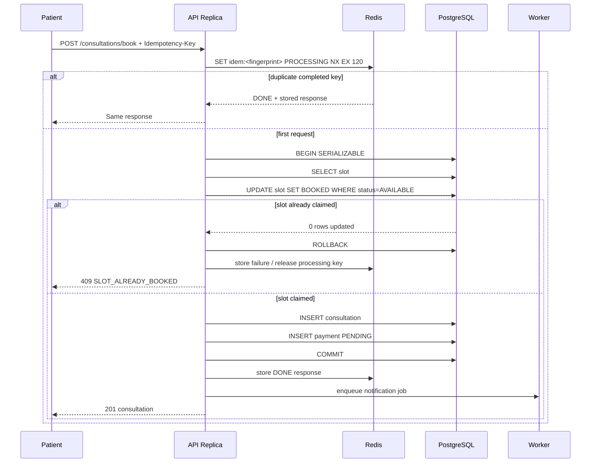

# Booking Flow Sequence

**Retry policy:** client retries the same request with the same idempotency key. Transient worker failures use exponential backoff with jitter. Database serialization failures may be retried a small bounded number of times inside the service boundary; the whole operation remains idempotent.
